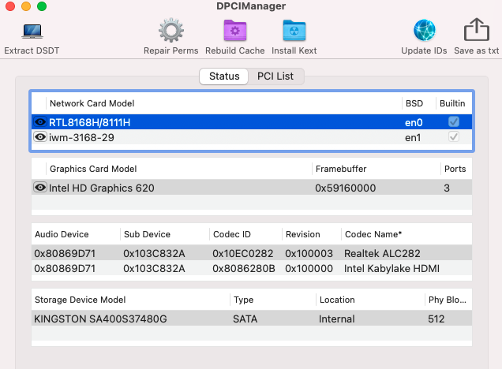

# HP-250-G6-Kabylake

### Computer Spec:

| Component        | Brank                              |
| ---------------- | ---------------------------------- |
| CPU              | Intel I3 7020U                     |
| iGPU             | Intel® HD Graphics 620             |
| Display          | 1366x768                           |
| Audio            | Realtek ALC282                     |
| Ram              | 8 Gb ddr4 2400 Mhz                 |
| Wifi + Bluetooth | AC 3168                            |
| SSD              | Kingston A400 512gb                |
| SmBios           | MacbookPro 14,1                    |
| BootLoader       | OpenCore 0.7.4                     |

 

## DPCIManager Screenshot

### What works and What doesn't or WIP:

- [x] Intel HD 620 iGPU HDMI Output
- [x] ALC282 Internal Speakers
- [x] ALC282 Native Combojack
- [x] ALC282 HDMI Audio Output
- [x] All USB Ports 
- [x] SpeedStep / Sleep / Wake
- [x] Touchpad with gesture
- [x] Brightness Key
- [x] Wi-Fi
- [x] Realtek RTL8111 LAN
- [x] Cardreader
- [x] ACPI Battery
- [x] NVRAM
- [x] Windows boot from OpenCore

### Special Config:

- Usb port mapping performed
- Disabled unused device
- Cosmetics DSM in Configplist

## Info Section HDMI video

## Info Section SSDT

## Credits

- [Acidanthera](https://github.com/acidanthera) for OpenCore and all the lovely hackintosh work.
- [Apple](https://apple.com) for macOS;
- [Dortania](https://github.com/dortania)
- [Hackintoshlifeit](https://github.com/Hackintoshlifeit)
- [rehabman](https://github.com/RehabMan)

# If you need help please contact us on [Telegram](https://t.me/HackintoshLife_it) or [Web](https://www.hackintoshlife.it/)
